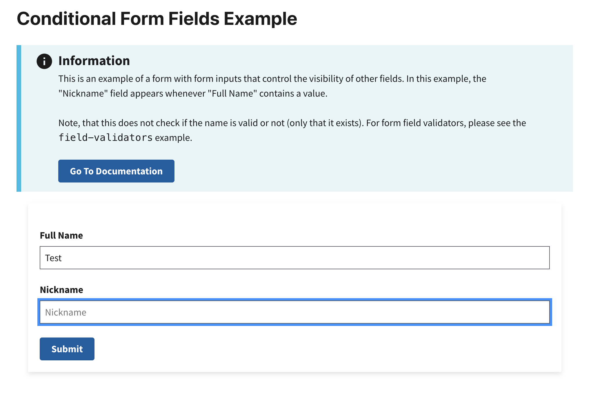

# Conditional Form Fields Example

[Official Documentation](https://nmfs-radfish.github.io/radfish/)

This example includes an example on how to build a form where the values of certain input fields control the visibility of other fields within that form. In this case, filling out `fullName` with make the `nickname` field visible. Removing `fullName` will make `nickname` disappear, as well as remove `nickname` from `formState`

Learn more about RADFish examples at the official [documentation](https://nmfs-radfish.github.io/radfish/developer-documentation/examples-and-templates#examples)

## Steps

1. Before building out your form, it's a good idea to define which inputs you want to render, and create constant variables for them, so that you can reference these variables, rather than typing out plain text strings. This reduces the possibility of typos and human error when building out reference logic:

```jsx
const fullName = "fullName";
const nickname = "nickname";
```

In this example, we will build a form with two inputs. The value from `fullName` inputs will control the visiblity of `nickname`.

2. Next, let's define our `Form` component, and intialize it with an empty `formState` object:

```jsx
const ConditionalForm = () => {
  const [formData, setFormData] = useState({});

  return (
    // form JSX will go here
  );
};
```

3. In the `Form.jsx` component, you can now build out the jsx inputs form your `Form` within the `return` statement of the component. See the below to see an example of how to build these inputs. Notice how we are referencing the variables defined in step 1, rather than typing out the plain strings to avoid typos, and use the variable to access the `formData` state. It's a good idea to wrap these inputs within a `FormGroup` component provided from the trussworks library.

```jsx
<TextInput
  id={fullName}
  name={fullName}
  type="text"
  placeholder="Full Name"
  value={formData[fullName] || ""}
/>
```

4. Now, for each input, we can create an `onChange` handler, that captures the input's value as it is being typed. We then update state with a copy of the existing `formState`, and update only the field value that we want to update (in this case `numberOfFish`). The value of this input will then re-render with the updated value from `formState`

```jsx
<TextInput
  id={fullName}
  name={fullName}
  type="text"
  placeholder="Full Name"
  value={formData[fullName] || ""}
  onChange={(event) => {
    const { value } = event.target;
    setFormData({
      ...formData,
      [fullName]: value,
    });
  }}
/>
```

5. Additionally, we want to conditionally render the `nickname` component, depending on whether or not the `fullName` value is set in `formState`. This input field will only render if `formData[fullName]` evaluates to `true`

```jsx
{
  formData[fullName] && (
    <>
      <Label htmlFor={nickname}>Nickname</Label>
      <TextInput
        id={nickname}
        name={nickname}
        type="text"
        placeholder="Nickname"
        onChange={(event) => {
          const { value } = event.target;
          setFormData({
            ...formData,
            [nickname]: value,
          });
        }}
      />
    </>
  );
}
```

6. Lastly, we want to make sure that we remove the value of `nickname` whenever the `fullName` component is empty. To do that we can add another form control within the `onChange` handler of the `fullName` input

```jsx
<TextInput
  id={fullName}
  name={fullName}
  type="text"
  placeholder="Full Name"
  value={formData[fullName] || ""}
  onChange={(event) => {
    const { value } = event.target;
    setFormData({
      ...formData,
      [fullName]: value,
      [nickname]: value === "" ? "" : formData[nickname],
    });
  }}
/>
```

# Conditional Form Fields Example Preview


