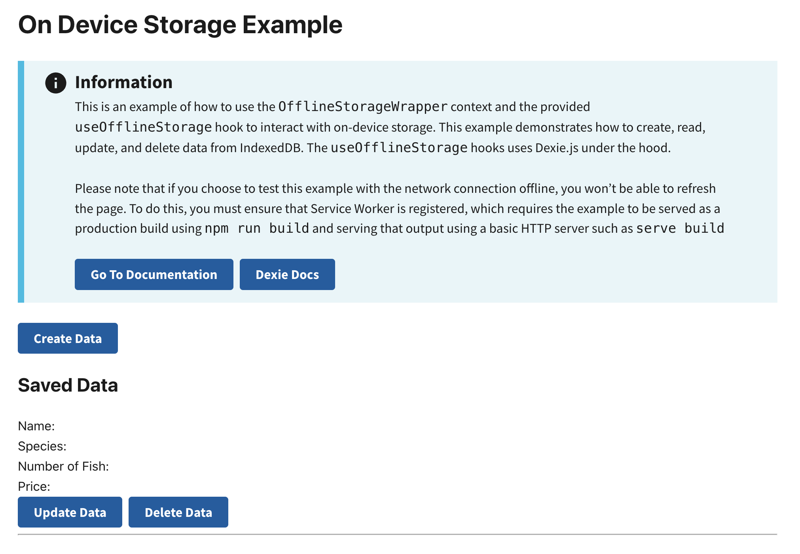

# On-Device Storage Example

[Official Documentation](https://nmfs-radfish.github.io/radfish/)

This example includes how to setup and use the on-device storage using IndexedDB and [Dexie.js](https://dexie.org/docs/Tutorial/Getting-started). Example use-cases for on-device storage:

- Offline on-device data storage (most cases)
- Local non-relational database (online or offline use)

Learn more about RADFish examples at the official [documentation](https://nmfs-radfish.github.io/radfish/developer-documentation/examples-and-templates#examples)

## Steps

1. In the `index.jsx` file, import the `OfflineStorageWrapper`, then create a configuration object:

```jsx
import { OfflineStorageWrapper } from "@nmfs-radfish/react-radfish";

const offlineStorageConfig = {
  // Type is either `indexedDB` or `localStorage`
  type: "indexedDB",
  // Database name
  name: import.meta.env.VITE_INDEXED_DB_NAME,
  // Database version number
  version: import.meta.env.VITE_INDEXED_DB_VERSION,
  // Table schema object must include the table name as the object key and a comma-separated string as the value. Please note `uuid` must be the first value in `formData` table.
  stores: {
    formData:
      "uuid, fullName, email, phoneNumber, numberOfFish, species, computedPrice, isDraft",
    species: "name, price",
    homebaseData: "KEY, REPORT_TYPE, SORT_KEY, TRIP_TYPE, VALUE",
  },
};
```

2. In the `index.jsx` file, wrap the `App` component with `OfflineStorageWrapper` and pass the config object:

```jsx
const root = ReactDOM.createRoot(document.getElementById("root"));

root.render(
  <React.StrictMode>
    <OfflineStorageWrapper config={offlineStorageConfig}>
      <App />
    </OfflineStorageWrapper>
  </React.StrictMode>
);
```

## `useOfflineStorage` Hook API

1. Use the `useOfflineStorage` context hook in any child components. See the `App.jsx` file for examples of how to use the provided hooks.

The `useOfflineStorage` hook returns an object with the following methods:

- `createOfflineDataEntry(tableName, data)` — Creates a new data entry in the storage.

  - `tableName`: Name of the IndexedDB name
  - `data`: The data object to create.
  - Returns a promise that resolves when the data is created.

- `findOfflineData(tableName, criteria)` — Finds data in the storage based on the given criteria, returns all data if not criteria parameter is passed.

  - `tableName`: Name of the IndexedDB name
  - `criteria`: The criteria object to use for finding data, eg `{uuid: 123}`.
  - Returns a promise that resolves to an array of tuples:
    `[ [ uuid, { key: value } ], [ uuid2, { key: value } ] ]`

- `updateOfflineDataEntry(tableName, data)` — Updates data in the storage

  - `tableName`: Name of the IndexedDB name
  - `data`: The updated data object.
  - Returns a promise that resolves to the updated data as an object:
    `{ numberOfFish: 10, species: salmon }`

- `deleteOfflineDataEntry(tableName, uuids)` — Deletes data by UUID
  - `tableName`: Name of the IndexedDB name
  - `uuids`: An array of UUIDs to delete
  - Returns a promise that resolves to the updated data as an object:
    `{ numberOfFish: 10, species: salmon }`

# On-Device Storage Example Preview
