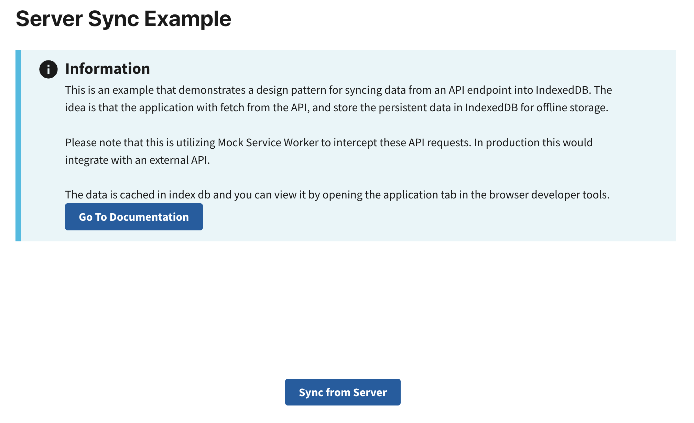

# ServerSync Component Example

[Official Documentation](https://nmfs-radfish.github.io/radfish/)

The `ServerSync` component is responsible for synchronizing data between a client application and a remote server. It handles offline status, provides feedback on the synchronization process, and manages local offline storage.

Learn more about RADFish examples at the official [documentation](https://nmfs-radfish.github.io/radfish/developer-documentation/examples-and-templates#examples)

## Features

- Synchronizes data with a remote server.
- Handles offline status and provides appropriate messages.
- Stores and retrieves synchronization data from offline storage.
- Provides a loading state during synchronization.
- Displays the last synchronization time.

## Dependencies

- `react` for managing component state and lifecycle.
- `radfish-react` for UI components like `Button`.
- Custom hooks: `useOfflineStatus` and `useOfflineStorage`.

## Installation

1. Ensure you have the required dependencies installed:

   ```bash
   npm install react radfish-react
   ```

2. Import the component and required hooks in your project:

   ```javascript
   import { ServerSync } from "./components/ServerSync";
   ```

## Usage

To use the ServerSync component, simply import it and include it in your JSX:

```javascript
function App() {
  import { ServerSync } from "./components/ServerSync";
  return (
    <div className="App">
      <ServerSync />
    </div>
  );
}

export default App;
```

## Adding Network Requests and Updating Offline Storage

To add network requests and update the offline storage in the syncToHomebase function, follow the steps below:

#### Add Network Request Logic:
 
For making network requests, please use a network request library of your choice. For example, you can use the native [fetch API](https://developer.mozilla.org/en-US/docs/Web/API/Fetch_API) or any other library that fits your needs.

```javascript
async function fetchData() {
  try {
    const response = await fetch('https://api.example.com/data', {
        headers: { "Content-Type": "application/json", "X-Access-Token": "your-access-token" },
    });

    if (!response.ok) {
      throw new Error('Network response was not ok');
    }
    const data = await response.json();
    console.log(data);
  } catch (error) {
    console.error('Error:', error);
  }
}

fetchData();
```


#### Update Offline Storage:

Once the data is fetched, store it in the offline storage using the updateOfflineData function.

Here is an example of how to integrate these steps into the syncToHomebase function:

```javascript
import { useState } from "react";
import { Button, useOfflineStatus } from "@nmfs-radfish/react-radfish";
import { useOfflineStorage } from "@nmfs-radfish/react-radfish";

const offlineErrorMsg = "No network connection, unable to sync with server";
const noSyncMsg = "Application has not yet been synced with homebase";
const dataNotSyncedMsg = "Data not synced, try resyncing";
const dataIsSyncedMsg = "All data cached, ready to launch!";

const HOME_BASE_DATA = "homebaseData";
const LAST_HOMEBASE_SYNC = "lastHomebaseSync";

export const ServerSync = () => {
  const { isOffline } = useOfflineStatus();
  const { updateOfflineData, findOfflineData } = useOfflineStorage();
  const [isLoading, setIsLoading] = useState(false);
  const [syncStatus, setSyncStatus] = useState("");


  const getRequestWithFetch = async (endpoint) => {
    try {
      const response = await fetch(`${endpoint}`, {
        headers: {"X-Access-Token": "your-access-token" },
      });

      if (!response.ok) {
        // Set error with the JSON response
        const error = await response.json();
        return error;
      }

      const data = await response.json();
      return data;
    } catch (err) {
      // Set error in case of an exception
      const error = `[GET]: Error fetching data: ${err}`;
      return error;
    }
  };

  const syncToHomebase = async () => {
    const lastSync = await findOfflineData(HOME_BASE_DATA);
    const lastSyncMsg = `Last sync at: ${await findOfflineData("lastHomebaseSync")}`;

    if (!isOffline) {
      setIsLoading(true);

      try {
        // Fetch data from the server
        const { data: homebaseData } = await getRequestWithFetch.MSW_ENDPOINT.HOMEBASE);

        // Update offline storage with the fetched data
        await updateOfflineData(HOME_BASE_DATA, homebaseData);
        await updateOfflineData("lastHomebaseSync", [{ uuid: "lastSynced", time: Date.now() }]);

        initializeLaunchSequence();
      } catch (error) {
        console.error("Failed to sync data:", error);
      } finally {
        setIsLoading(false);
      }
    } else {
      console.log(offlineErrorMsg);
      console.log(`${lastSync ? lastSyncMsg : noSyncMsg}`);
      setIsLoading(false);
    }
  };

  const initializeLaunchSequence = async () => {
    const homebaseData = await findOfflineData(HOME_BASE_DATA);

    if (!homebaseData.length) {
      setSyncStatus({ status: false, message: dataNotSyncedMsg });
    }
    // 7 is the amount of data expected from homebase response, but this can be any check
    if (homebaseData.length === 7) {
      setSyncStatus({ status: true, message: dataIsSyncedMsg });
    }
    setTimeout(() => {
      setSyncStatus({ status: null, message: "" });
    }, 1200);
  };

  if (isLoading) {
    return <Button onClick={syncToHomebase}>Syncing to Server...</Button>;
  }

  return (
    <div className="server-sync">
      <Button onClick={syncToHomebase}>Sync from Server</Button>
      <span
        className={`${syncStatus.status ? "text-green" : "text-red"} margin-left-2 margin-top-2`}
      >
        {syncStatus.message}
      </span>
    </div>
  );
};
```

# Server Sync Example Preview
